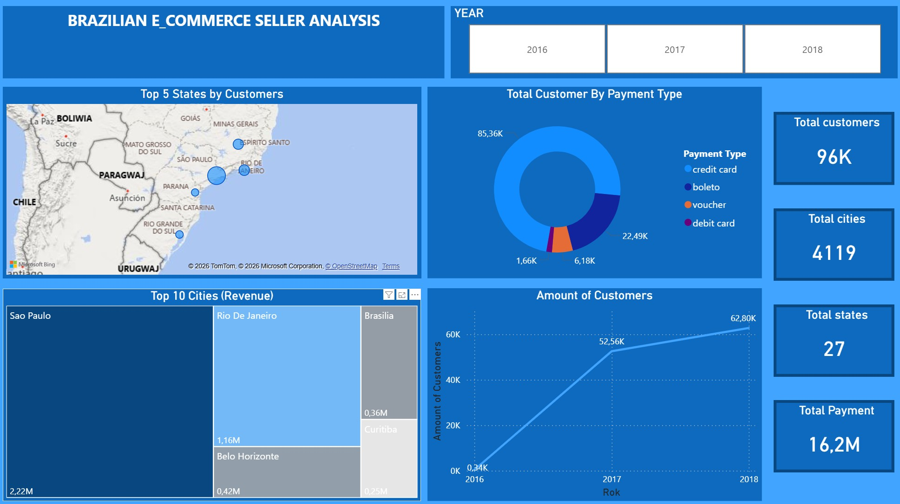
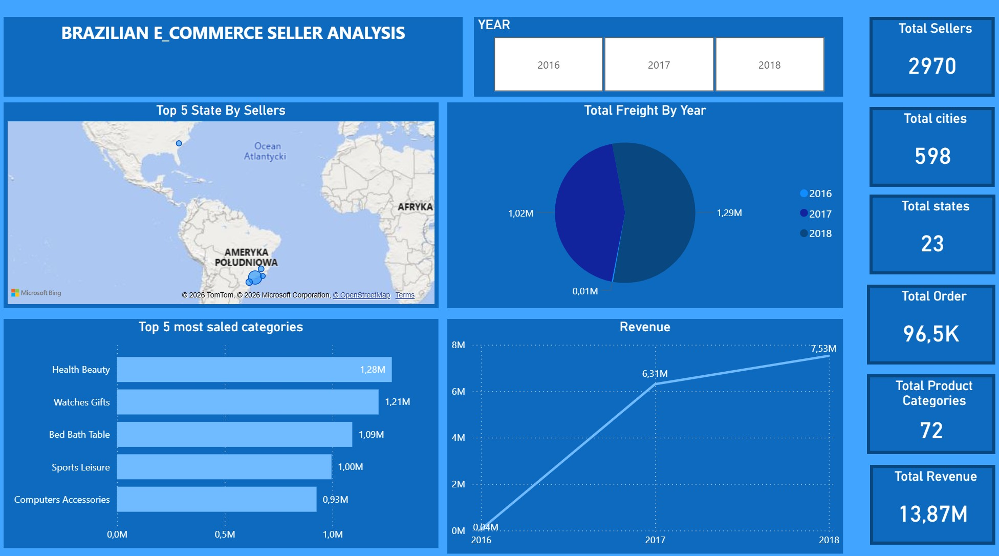
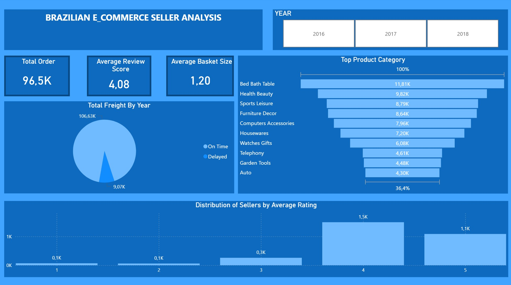

# olist-end-to-end-bi-analysis

# 🇧🇷 Brazilian E-commerce Analytics Pipeline
### End-to-End Data Engineering & BI Project (AWS → Snowflake → Power BI)

##  Project Overview
This project demonstrates a full-scale data pipeline for the **Olist E-commerce dataset**. The goal was to build a modern data warehouse (DWH) using the **Medallion Architecture**, moving from raw storage in a Data Lake to a fully functional business dashboard.

---

## Phase 1: Data Lake & Storage Optimization (AWS Athena)
In this phase, I established a **Cloud Data Lake** architecture using **Amazon S3** for storage and **AWS Athena** as the serverless query engine. The focus was on establishing a high-performance analytical foundation.

### Data Ingestion & Transformation
- **Raw Ingestion:** Established a "Schema-on-Read" layer by defining external tables for the original **CSV** dataset.
- **Optimization (CTAS):** Executed an ETL process within Athena using **CTAS (Create Table As Select)** to convert raw CSV files into **Apache Parquet**.
- **Compression:** Applied **Snappy compression** to minimize I/O costs and accelerate data transfer to Snowflake.

### Storage Efficiency Experiment
I conducted a technical comparison to validate the benefits of columnar storage (Parquet) over row-based storage (CSV). Even on a small-scale dataset, the results were significant:

| Format | Storage Size | Reduction |
| :--- | :--- | :--- |
| **Raw CSV** | 123 MB | - |
| **Optimized Parquet** | **61 MB** | **~50%** |

> **Key Insight:** Converting to Parquet resulted in a **50% storage reduction**. In a production environment at terabyte scale, this optimization translates directly into massive cost savings and drastically faster query execution times.

---

## Phase 2: Data Warehouse Architecture (Snowflake)
Data was ingested into Snowflake using the **Medallion Architecture** to ensure data quality and lineage.

### 🥉 Bronze Layer (Staging)
- Data ingested from S3 using **External Stages** and **Parquet File Formats**.
- Used `MATCH_BY_COLUMN_NAME` to automate schema mapping from Parquet metadata.

### 🥈 Silver Layer (Cleansing)
- **Data Normalization:** Standardized city names using `TRANSLATE` and `REGEXP` to handle Brazilian Portuguese diacritics.
- **Data Quality:** Filtered out invalid geographic coordinates and handled missing values.
- **Automation:** Logic encapsulated in **Stored Procedures** for repeatable execution.

### 🥇 Gold Layer (Analytical/Reporting)
- Created business-ready **Views** (Fact and Dimension tables).
- **Business Logic:** Calculated KPIs such as `Actual Delivery Days` and `Delivery Performance vs. Estimated`.
- **Localization:** Mapped Portuguese category names to English for global business reporting.

---

## Phase 3: Data Visualization (Power BI)
The final result is a professional **Executive Dashboard** focused on seller performance and customer distribution.

- **Design:** Consistent Blue/Dark theme for high readability.
- **Key Features:** 
    - Interactive map showing customer concentration.
    - **Top 10 Cities Treemap:** Visualizing revenue distribution by urban centers.
    - Order status and payment type analysis.
- **Technical Detail:** Connected to Snowflake's Gold Layer via DirectQuery/Import to ensure data consistency.

---

## Dashboard preview (Power BI)

**Brazilian E-Commerce Analysis: Executive Summary / Sellers & Logistics / Operations**

<!-- 1. Główny Dashboard (Executive Summary) -->

  

<!-- 2. Pozostałe dwa dashboardy obok siebie -->

  
  

---
## Tech Stack
- **Cloud Storage:** Amazon S3
- **Data Lake Engine:** AWS Athena (Presto/Trino)
- **Data Warehouse:** Snowflake
- **ETL/Scripting:** SQL (Snowflake Scripting), Stored Procedures
- **BI Tool:** Power BI
